# claude-code-structured-concurrency

> Kernel-enforced cleanup of orphaned Claude Code subprocesses on Windows. Wraps `claude.exe` in a Win32 Job Object so the OS reaps every child on exit, including crashes.

[](LICENSE)
[](#requirements)
[](#requirements)
[](#tests)

Claude Code spawns 40-60 child processes per session (MCP servers, plugins, LSPs, hooks). On Windows they often outlive their parent. After a few days, Task Manager fills with `Node.js JavaScript Runtime` entries from sessions that closed hours ago, and reboot becomes the cleanup primitive. This skill wires up the same kernel mechanism Chrome, Edge, and VS Code use to bound helper-process lifetime, so the OS reaps the tree instead.

Verified 9 ms reap latency on Windows 11 build 26200. 22 unit assertions plus 1 functional test, all passing.

<p align="center">
  
</p>

## Requirements

- Windows 10 build 17134 (January 2018) or later. Job Object behavior was unreliable for this pattern on older builds.
- PowerShell 5.1 (default Windows install) or PowerShell 7+. Git Bash also works (via `~/.bashrc`).
- Zero external dependencies. No PowerShell modules, no Node, no Python.

> [!IMPORTANT]
> **PowerShell only. cmd.exe is not supported.** The wrapper alias relies on `$PROFILE`, which is a PowerShell concept. cmd.exe has no equivalent profile mechanism, so plain `claude` typed into a cmd.exe window bypasses the wrapper and runs unprotected. Use PowerShell or Git Bash. Per-launcher details and remedies live in [`docs/FAQ.md`](docs/FAQ.md).

## Install

```powershell
git clone https://github.com/ron2k1/claude-code-structured-concurrency `
    "$env:USERPROFILE\.claude\skills\structured-concurrency"

& "$env:USERPROFILE\.claude\skills\structured-concurrency\tools\install-reap.ps1" -ShadowClaude
```

`-ShadowClaude` redefines plain `claude` as a function that delegates to the wrapper. Without it, you have to type `claude-jobbed` every time you want protection. PowerShell resolves Functions before PATH, so the function wins over `claude.exe` at parse time.

Open a fresh PowerShell window and confirm:

```powershell
Get-Command claude
# CommandType=Function (Definition: claude-jobbed @args)  ->  wrapped
# CommandType=Application                                  ->  NOT wrapped
```

> [!WARNING]
> Install does not wrap a session that's already running. Close existing CC windows and start a new shell after install.

## Components

| Tool | Layer | What it does |
|------|-------|--------------|
| [`tools/cc-procs.ps1`](tools/cc-procs.ps1) | Visibility | Read-only inventory: PID, parent, age, memory, classification, orphan flag. No kill capability. |
| [`tools/cleanup-orphans.ps1`](tools/cleanup-orphans.ps1) | Cleanup | Terminates strict-orphan subtrees per `~/.reap/config.json`. Dry-run by default. |
| [`tools/claude-jobbed.ps1`](tools/claude-jobbed.ps1) | Prevention | Win32 Job Object wrapper. Kernel terminates the entire CC tree on wrapper exit. |

```powershell
.\tools\cc-procs.ps1                # see what's running
.\tools\cleanup-orphans.ps1         # dry-run a reap
.\tools\cleanup-orphans.ps1 -Force  # actually reap
```

Inside a Claude Code session, the same flow is `/structured-concurrency [kill|install|verify]`.

A SessionStart hook (`hooks/reap-on-start.ps1`) runs the cleanup in strict-orphan-only mode on every CC start, so leftovers from un-wrapped or crashed sessions are reaped automatically.

## Configuration

The cleanup engine is **dangerous-by-omission**. Without `~/.reap/config.json`, `cleanup-orphans.ps1 -Force` is a guaranteed no-op. Aggression is opt-in.

Pick a starter profile at install time:

| Profile | Behavior |
|---------|----------|
| `conservative` | Spare almost everything. |
| `moderate` | Default. Kill standard MCP chains. |
| `aggressive` | Also kill `node.exe` and `cmd.exe` orphans. |
| `paranoid` | Observe-only. Never kills. |

```powershell
.\tools\install-reap.ps1 -ConfigProfile moderate
```

The decision flow always runs spare layers before kill layers (`spare_classifications` then `spare_cmdline_patterns` then `kill_names` then `kill_classifications`). `claude.exe` is classified as `claude` and `claude` is in the default `spare_classifications`, so it cannot be killed even if the user adds `node.exe` to `kill_names`. This invariant is exercised explicitly in `tests/test-config-loader.ps1`.

Full schema, the `predicate.ps1` escape hatch for procedural rules, and worked configs ("I run in-house MCPs", "I want aggressive cleanup with a safety net") live in [`docs/CONFIGURATION.md`](docs/CONFIGURATION.md).

## How it works

`JOB_OBJECT_LIMIT_KILL_ON_JOB_CLOSE` is a flag on Win32 Job Objects: when the last handle to the job is closed, the kernel terminates every member process. Browser sandboxes use this to bound renderer and tab lifetime. Linux has the equivalent in `prctl(PR_SET_PDEATHSIG)` plus cgroups. Windows ships the primitive too. No Node.js runtime wires it up for child processes spawned from Claude Code.

`claude-jobbed.ps1` does the wiring:

1. `CreateJobObjectW` via P/Invoke.
2. `SetInformationJobObject` with `JOB_OBJECT_LIMIT_KILL_ON_JOB_CLOSE`.
3. Spawn `claude.exe` and assign it to the job. Descendants inherit membership.
4. Wait for `claude.exe` to exit, then exit.
5. On wrapper exit (graceful, crash, BSOD, X-button close, Task Manager End-Task), the OS closes the job handle. The kernel walks the job and calls `TerminateProcess` on every member.

There is no application code path that can leak. This is structured concurrency enforced by the operating system, the way Nathaniel J. Smith [originally framed](https://vorpus.org/blog/notes-on-structured-concurrency-or-go-statement-considered-harmful/) the problem class. Application discipline is what produced the leaks in the first place.

Full architecture: [`DESIGN.md`](DESIGN.md).

## Tests

22 unit assertions plus 1 functional test, all passing on Windows 11 build 26200.

| Suite | Coverage |
|-------|----------|
| `tests/test-job-object.ps1` | Functional. Spawns a sleeping child, closes the job handle, asserts the child died within 2 seconds. **9 ms measured.** |
| `tests/test-orphan-detect.ps1` | Synthetic snapshots. Orphan detection, PID-reuse guard via `StartTime` comparison, classification, descendant tree walk. |
| `tests/test-config-loader.ps1` | Config schema. Defaults, malformed-JSON fallback, partial-config merge, and the spare-wins-over-kill safety invariant. |

```powershell
.\tests\test-job-object.ps1
.\tests\test-orphan-detect.ps1
.\tests\test-config-loader.ps1
```

If a suite fails on your Windows build, file an issue with the output of `winver`. The Job Object test in particular catches kernel-level edge cases on older builds.

## Safety guarantees

- `cc-procs.ps1` never kills. No `Stop-Process`, no `taskkill`, no `TerminateProcess`. Run it any time.
- `cleanup-orphans.ps1` defaults to dry-run. Live kills require both `-Force` and a config that opts in. With no `~/.reap/config.json`, the engine is a guaranteed no-op even with `-Force`.
- The engine never blanket-kills `node.exe` by name. `spare_classifications` always runs first.
- `claude-jobbed.ps1` is opt-in. Plain `claude.exe` still works without the wrapper, just unprotected.

## What this does not do

- Replace Claude Code's own subprocess discipline. Anthropic can ship Job Objects natively. This is the user-side workaround until they do.
- Help on macOS or Linux. Both already have OS-level reapers (`prctl(PR_SET_PDEATHSIG)` + cgroups, equivalent semantics on macOS).
- Wrap a `claude.exe` that's already running. Restart your shell after install.
- Cover launchers that don't read `$PROFILE`: cmd.exe, `Win+R`, desktop shortcuts to `claude.exe`, Task Scheduler entries, VS Code's terminal until reloaded after install. See [`docs/FAQ.md`](docs/FAQ.md) for per-path remedies.

## License

MIT. See [`LICENSE`](LICENSE).

Author: Ronil Basu ([@ron2k1](https://github.com/ron2k1)).

## Reading

- [Notes on structured concurrency, or: Go statement considered harmful](https://vorpus.org/blog/notes-on-structured-concurrency-or-go-statement-considered-harmful/), Nathaniel J. Smith, 2018. The piece that named the problem class.
- [Win32 Job Objects](https://learn.microsoft.com/en-us/windows/win32/procthread/job-objects), Microsoft documentation for the kernel primitive.
- [`AssignProcessToJobObject`](https://learn.microsoft.com/en-us/windows/win32/api/jobapi2/nf-jobapi2-assignprocesstojobobject), the Win32 call `claude-jobbed.ps1` uses to attach `claude.exe` to the job.
